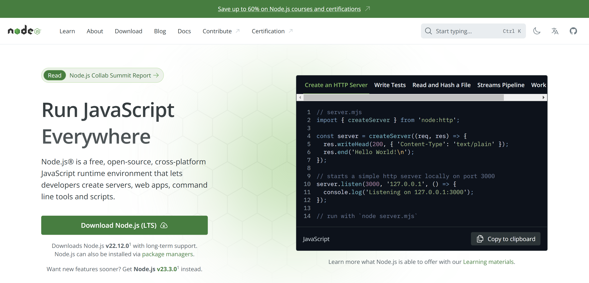
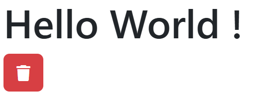
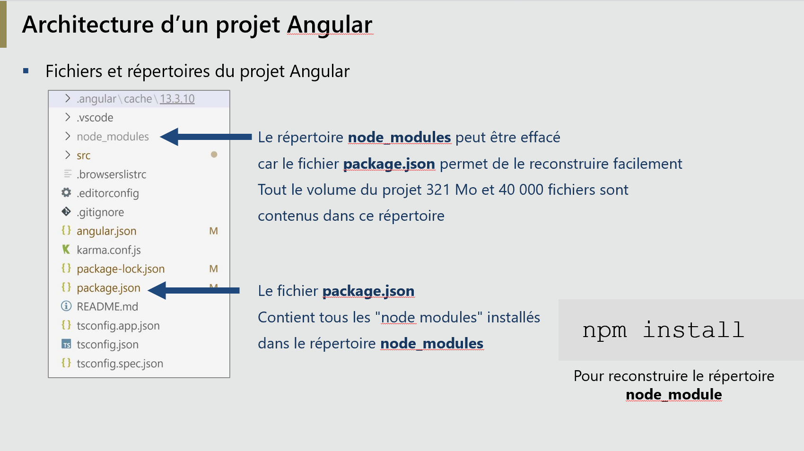
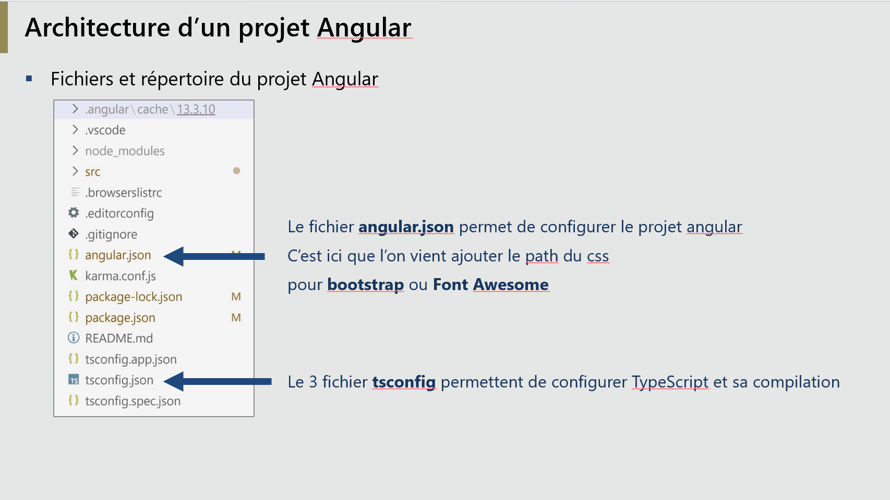
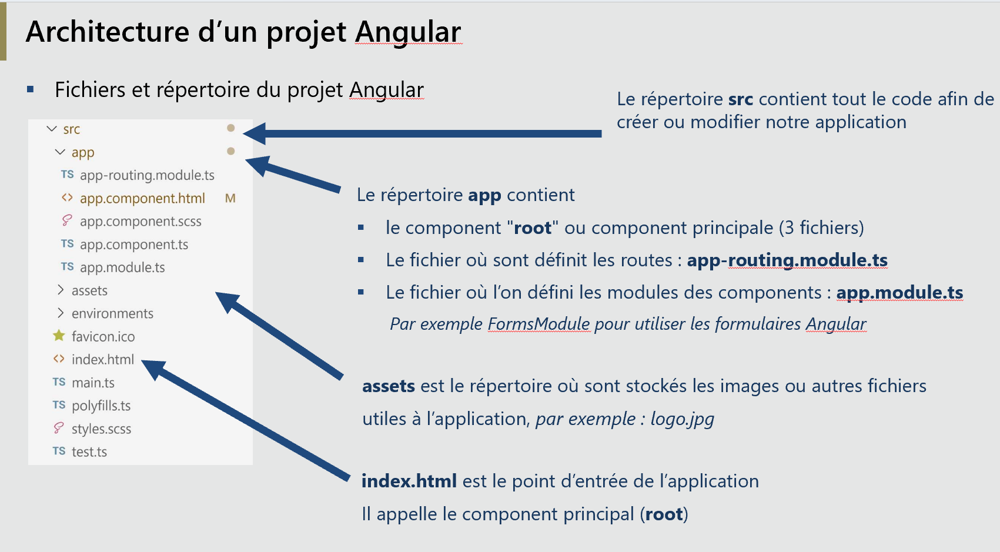
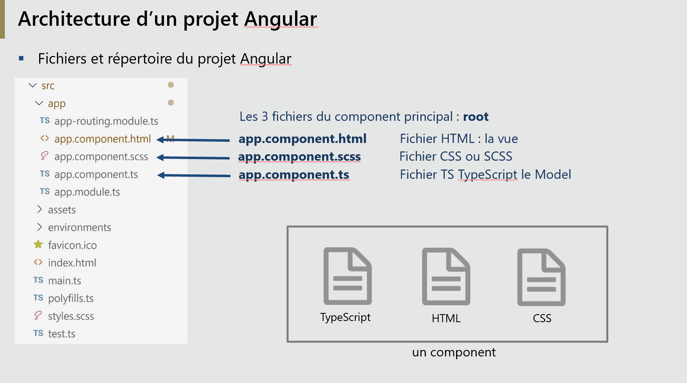

# Module 03 - Création du premier projet Angular

# 1 - Installer Node JS


Choisir **LTS**  
v22.12.0 **le 9 décembre 2024**


# 2 - Création du répertoire pour les projets
**Arcitecture** :  


Choisir le terminal **Command Prompt**  
Revenir sur <code>c:</code>
```
cd\
```
Créer un répertoire  <code>prj-angular</code>  
<code>md</code>  pour **m**ake **d**irectory
```
md prj-angular
```
Allez dans le répertoire <code>prj-angular</code>  
```
cd prj-angular
```
Nous avons :
```
C:\
|-- prj-angular
```


# 3 - Installer le CLI d'Angular
```
npm i -g @angular/cli   
```

## :one: Création du projet
**premier-prj** c'est le nom du projet : ***modifier le si besoin***
```
ng new premier-prj --style=scss --skip-tests=true
```
- Nous choissons **sass**  : <code>--style=scss</code>
Comme celà le jour où nous passons à scss : tout est prêt  
Et nous pouvons en attendant continuer à utiliser le **CSS** classique  

- Nous enlevons les **fichier de tests**   : <code>--skip-tests=true</code>

**? Do you want to enable Server-Side Rendering (SSR) and Static Site Generation (SSG/Prerendering)? (y/N)**
Répondre **N**  
- Nous choisissons **SSG** pour un mode applicatif 
**SSG** **S**tatic **S**ite **G**eneration :Pas de SEO  
**SSR** Server Side Rendering : NO
C'est à dire ready for **SEO** les google bots peuvent parser notre site !

On peut le rajouter après ***ng add @angular/ssr***

- Nous choisissons **y** pour pour le google analytics
Afin de ne pas envoyer des données aux **US** et respecter le RGPD   

Nous avons désormais un nouveau répertoire pour notre projet
```
|-- prj-angular
        |-- premier-prj
```

## :two: Allez dans le répertoire du projet

```
cd premier-prj
```
**Nous avons :**   
C:\prj-angular\premier-prj\

## :three: Ajouter Bootstrap 5
```
npm i bootstrap
```

## :four: Ajouter FontAwesome
```
npm i --save @fortawesome/fontawesome-free
```

## :five: Ouvrir VS code sur ce projet
```
code .
```

## :six: Modifier le fichier : angular.json
Pour ajouter **Bootstrap 5** et **FontAwesome**  
**Ajouter ces 2 lignes :**
```
               "./node_modules/@fortawesome/fontawesome-free/css/all.min.css",
               "./node_modules/bootstrap/dist/css/bootstrap.css"
```
**Avant**
```json  title="angular.json"
 "styles": [
              "src/styles.scss"
            ],

```
  
:warning: Ajouter la virgule <code>,</code> à la fin de la ligne <code>"src/styles.scss"</code> +<code>,</code>     
  
**Après**
```
 "styles": [
              "src/styles.scss",
               "./node_modules/@fortawesome/fontawesome-free/css/all.min.css",
               "./node_modules/bootstrap/dist/css/bootstrap.css"
            ],

```
## :seven: Je lance le locahost

http://localhost:4200
  
Je lance le locahost
```
ng serve -o
```
## :eight: mon premier "Hello World"

**app.component.html**
```html
<div class="container">
  <h1>Hello World !</h1>
  <button class="btn btn-danger">
    <i class="fa fa-trash"></i>
  </button>
</div>
```


Je vérifie l'ajout de **bootstrap** et **FontAwesome**
    
**Affichage :**  

-----------------------



-----------------------


# Etat des lieux de notre premier projet :

  
  

  
  

  
  

