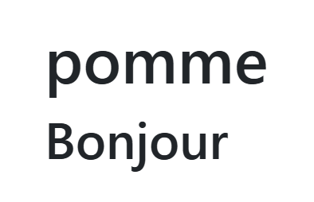

# Les 3 notions de base
__Pour créer une application angular__
  
:one: L'interpolation : Afficher des variable    
:two: La liaison par évènement **event binding** : le clique sur le bouton   
:three: le liaison bidirectionnel **2 ways binding** : Je récupère la saisie du champ input   


# :one: Notion 1 - L'interpolation

    
- L'interpolation ou "Double moustaches"    
- Permet d’afficher :  
  - des attributs   
  - ou ce que retourne une méthode TypeScript    
  
**app.component.ts** (version 1)
```ts
//...
export class AppComponent {
  fruit = 'pomme';
  disBonjour(){
    return 'Bonjour';
  }
}
```
Je suis en **TypeScript** woow  !  
Alors let's go !    
je rajoute <code>:string</code>  
  
**app.component.ts** (version 2)
```ts
//...
export class AppComponent {
  fruit:string = 'pomme';
  disBonjour():string{
    return 'Bonjour';
  }
}
```

**app.component.html**
```html
<h1>{{fruit}}</h1>
<h2>{{disBonjour()}}</h2>
```
**Résultat obtenu :** 

-----------------------



-----------------------

# :two: Notion 2 : La liaison par évènement
- La liaison par évènement <code>event binding</code>
- se met Généralement sur le bouton : <code><button>GO</button></code>
- Permet d'appeler une méthode TypeScript
- Bonne pratique : préfixer avec **on** :  *par exemple onCalculer()*  

**app.component.ts**
```ts
//...
export class AppComponent {
  fruit:string = '';
  onAffiche():void{
    this.fruit='kiwi';
  }
}
```

**app.component.html**
```html
  <button (click)="onAffiche()">Affiche</button>
  <h1>{{fruit}}</h1>
```
# :three: Notion 3 : La liaison bidirectionnelle

La liaison bidirectionnelle : **2 ways binding** (en anglais)
- Permet de relier un champ tel que input à un attribut  
- Les échanges se font en temps réels  
- :waning :
    - :one: Il faut importer FormsModule 
    - :two: rajouter dans les imports du décorateur  <code>FormsModule</code> 
- Moyen mémo-technique ***Banana in the box***  : **[()]** :banana:

**app.component.ts**
```ts
import { Component } from '@angular/core';
// 1- Il faut importer FormsModule
import { FormsModule } from '@angular/forms';
@Component({
  selector: 'app-root',
  // 2 rajouter dans les imports du décorateur :  "FormsModule"
  imports: [FormsModule],
  templateUrl: './app.component.html',
  styleUrl: './app.component.scss'
})

export class AppComponent {
  nom='';
  fruit = '';
  onAffiche(){
    this.fruit=this.nom.toUpperCase();
  }
}
```
**app.component.html**
```html
  <input [(ngModel)]="nom"/>
  <button (click)="onAffiche()">Affiche</button>
  <h1>{{fruit}}</h1>
```

# Je build et Je livre !!
Builder son projet pour le mettre en ligne :
- Si l’application se trouve à la racine du site

 ```
ng build
```
- Si l’application se trouve dans un sous répertoire <code>mon-projet</code> (ex : 
www.mon-site.fr/mon-projet)  
 ```
ng build --base-href=/mon-projet
``` 
- Pour récupérer les fichiers buildés, prenez le contenu du répertoire <code> dist/premier-prj/ </code>

- Et copier le contenu dans le répertoire <code>mon-projet</code> ou à la racine de votre hostin