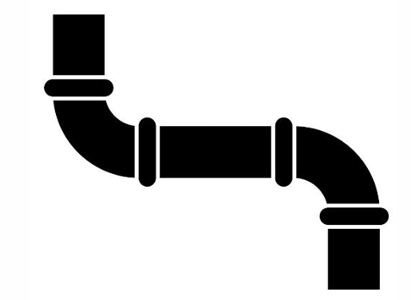
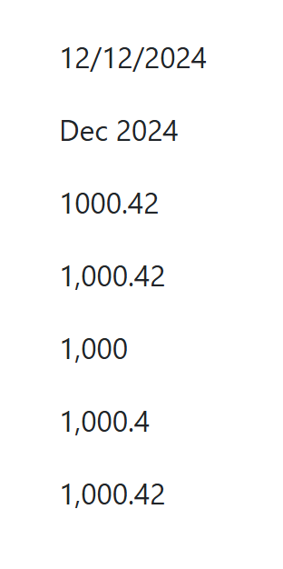
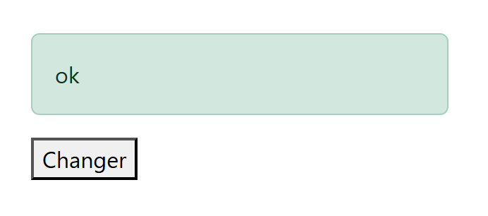
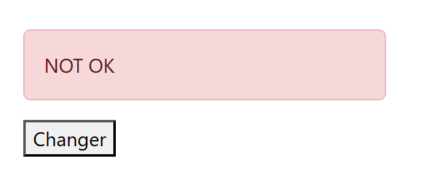
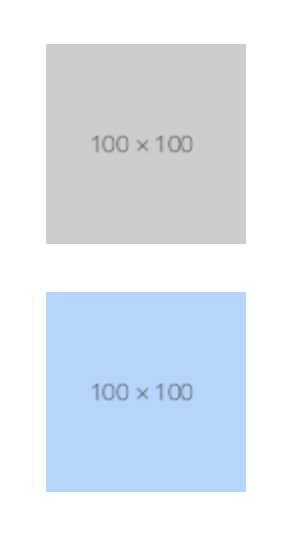
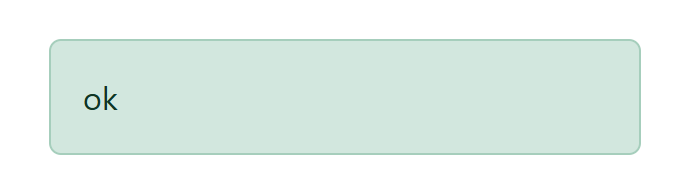
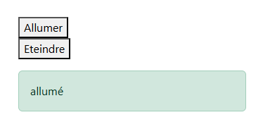
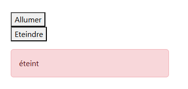
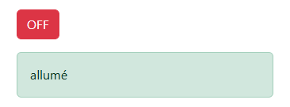
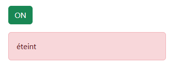

# Module 05 - Les notions Basiques complémentaires
:one: Les pipes pour compléter l'interpolation  
:two: Les directives par attribut ngClass  
:three: La liaison par attribut  
:four: La directive structurelle ngIF  

## :one: Les "PIPE" : "|""
https://angular.fr/pipes/number  
https://angular.fr/pipes/date  



Afin d'utiliser les "pipe" nous devons importer **CommonModule**
### Exemple :
**app.component.ts**
```ts
import { Component } from '@angular/core';

import { CommonModule } from '@angular/common';

@Component({
  selector: 'app-root',
  // importer CommonModule 
  imports: [CommonModule],
  standalone: true,
  templateUrl: './app.component.html',
  styleUrl: './app.component.scss'
})

export class AppComponent {
 mydate = new Date();
 num:number = 1000.42;
}

```

**app.component.html**
```html
  <p>{{ mydate | date: 'dd/MM/YYY' }}</p>
  <p>{{ mydate | date: 'MMM YYYY' }}</p>
  <p>{{ num }}</p>
  <p>{{ num | number }}</p>
  <p>{{ num | number:'1.0-0' }}</p>
  <p>{{ num | number:'1.0-1' }}</p>
  <p>{{ num | number:'1.0-2' }}</p>
```
**Affichage :**  


## :two: Directive par attribut [ngClass]
La structure :
**nom-de-la-classe-css** : mettre une classe CSS par exemple   
**variable** : Attribut définit dans le fichier TS     
**valeur** : IF : comparaison avec une valeur
  
**Structure :**
```html
<div  
[ngClass]={'nom-de-la-classe-css' : variable == valeur } >
 test
</div>
```
### Exemple :
**app.component.ts**
```ts
export class AppComponent {
  etat: string = 'ok';
  onchanger() {
    if (this.etat == 'ok') {
      this.etat = 'NOT OK';
    } else {
      this.etat = 'ok';
    }
  }
}
```
**app.component.html**
```html
  <div class="alert"
  [ngClass]="{
    'alert-success': etat == 'ok',
    'alert-danger': etat == 'NOT OK'
  }">
    {{etat}}
  </div>

<button (click)="onchanger()">
  Changer
</button>
```
**Affichage :**  


  


## :three: Liaison par attribut [nom-de-l-attribut]
**attribut** : attribut de balise HTML  
**variable** : relier à une variable du fichier TS  
  
**Structure :**
```html
 <div [attribut]="variable"> </div>
```
### Exemple
**app.component.ts**
```ts
export class AppComponent {
 myImg ='https://dummyimage.com/100x100/ccc/444';
  getImg() {
    return 'https://dummyimage.com/100x100/b6d4fe/444';
  }
}
```

**app.component.html**
```html


<br><br>


```
**Affichage :** 
  



## :four: Directive structurelle *ngIF
- La directive structurelle **Structural directive**
- Elle permet d'afficher ou non une ou des balises HTML
- En fonction d'un attribut ou d'une méthode

**variable** : relier à une variable du fichier TS  

**Structure :**
```html
<div *ngIf="variable == valeur"> lorem </div>
```

### Exemple
**app.component.ts**
```ts
export class AppComponent {
  etat: string = 'ok';
}
```
**app.component.html**
```html
<div *ngIf="etat === 'ok'"
  class="alert alert-success">
  ok
</div>
```
  
**Affichage :** 
  


# Démo compléte sur un état on/OFF

## Démo Allumer et Eteindre partie 1

  
  
  

<code>app.components.html</code>

```html
<div class="container">
  
  <div class="col-3">
<button (click)="onAllumer()">Allumer</button>
<br>
<button (click)="onEteindre()">Eteindre</button>
<!-- class="alert-danger"
class="alert-success" -->

<div class="alert" [ngClass]="{
  'alert-success' : status === 'allumé',
  'alert-danger' : status === 'éteint'}">
  {{ status }}
</div>
</div>
```
<code>app.components.ts</code>

```ts
import { CommonModule } from '@angular/common';
import { Component } from '@angular/core';


@Component({
  selector: 'app-root',
  imports: [CommonModule],
  templateUrl: './app.component.html',
  styleUrl: './app.component.scss'
})
export class AppComponent {
  status:string = 'allumé';
  onAllumer(){
    this.status = 'allumé';
  }
  onEteindre(){
    this.status = 'éteint';
    
  }
}
```
## Démo Allumer et Eteindre partie 2

<code>app.components.html</code>

```html
<div class="container">
  
  <div class="col-3">
<button (click)="onAllumer()">Allumer</button>
<br>
<button (click)="onEteindre()">Eteindre</button>
<!-- class="alert-danger"
class="alert-success" -->

<div class="alert my-3" [ngClass]="maClasse">
  {{ status }}
</div>
</div>
```
<code>app.components.ts</code>

```ts
<div class="container">
  
  <div class="col-3">
<button (click)="onAllumer()">Allumer</button>
<br>
<button (click)="onEteindre()">Eteindre</button>
<!-- class="alert-danger"
class="alert-success" -->

<div class="alert my-3" [ngClass]="maClasse">
  {{ status }}
</div>
</div>
```

## Démo Allumer et Eteindre partie 3
  
  
  

<code>app.components.html</code>

```html
<div class="container">
  
  <div class="col-3">

    <button 
    (click)="onSwitch()"
    class="btn mt-3" 
    [ngClass]="{
      'btn-danger': status==='allumé',
      'btn-success': status==='éteint'
  }">
  <span *ngIf="status==='éteint'">ON</span>
  <span *ngIf="status==='allumé'">OFF</span>
 

    </button>
<!-- class="alert-danger"
class="alert-success" -->

<div class="alert my-3" [ngClass]="maClasse">
  {{ status }}
</div>
</div>
```
<code>app.components.ts</code>

```ts
import { CommonModule } from '@angular/common';
import { Component } from '@angular/core';


@Component({
  selector: 'app-root',
  imports: [CommonModule],
  templateUrl: './app.component.html',
  styleUrl: './app.component.scss'
})
export class AppComponent {
  status: string = 'allumé';
  maClasse: string = 'alert-success';
  onSwitch() {
    if (this.status === 'allumé') {
      this.status = 'éteint';
      this.maClasse = 'alert-danger';
    } else {
      this.status = 'allumé';
      this.maClasse = 'alert-success';
    }
  }

}
```