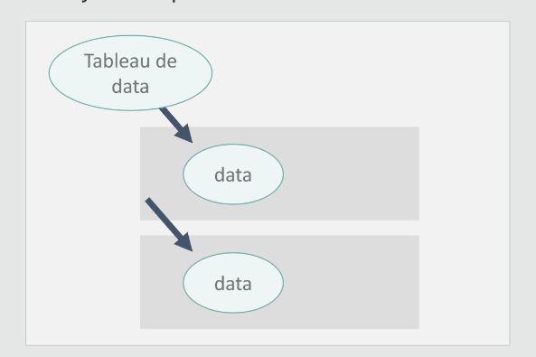

# Module 09 - Création d'un composant
 

:one: Création d'un composant  
:two: Appeler un composant depuis le composant principal (root)  
:three: Envoyer des données à un composant  
:four: Recevoir des données depuis un composant  et les Afficher  
:five: Appeler plusieurs composants depuis un tableau d'objet  
:six: Créer une classe **BO** **B**usiness **O**bject avec TypeScript  

## Présentation
Dans le composant principale nous allons créer et appeler un composant enfant  
 Nom du composant enfant <code>guest</code> : <code>&lt;app-guest&gt;&lt;/app-guest&gt;</code>  


**Architecture du composant guest**  
  


## :one: Création du composant
Pour créer un nouveau composant : **guest** dans le terminal 

il faut arrêter le serveur : <kbd>CTRL</kbd> + <kbd>C</kbd>

```
ng generate component guest
```
**Ou** plus rapide avec la première lettre de **g**enerate et **c**omponent 
```
ng g c guest
```
------------------------------
On n'oublie pas de relancer le serveur !
```
ng serve
```
------------------------------
- Un nouveau répertoire est créé : <code>guest</code> dans le répertoire <code>app</code>  
- Les 3 fichiers du composant sont aussi créés


## :two: Appeler le composant enfant
- Depuis la vue (HTML) du composant **mère** ou **root** app.component.html  
- Le component enfant <code>guest</code> va être appelé 


**app.component.ts**
```ts
// on importe le composant enfant dans le composant mère
import { GuestComponent } from './guest/guest.component';
@Component({
  selector: 'app-root',
  // on ajoute le composant dans les imports
  imports: [GuestComponent],
  templateUrl: './app.component.html',
  styleUrl: './app.component.scss',
})
```
**app.component.html**
```html
  <h1>Personnes</h1>
  <app-guest></app-guest>
  <app-guest></app-guest>
  <app-guest></app-guest>
```


**Affichage :**  


## :three: Envoyer des données à un composant

***Depuis le componsant mère ou root*** 
Nous envoyons des données au composant enfant : **guest**
- Création d'attributs dans la balise du component enfant
- Les données sont envoyées via les attribut **en dur**


**app.component.html**
```html
 <h1>Personnes</h1>
  <app-guest prenom="Brad" nom="PITT"></app-guest>
  <app-guest prenom="Bruce" nom="WILLIS"></app-guest>
  <app-guest prenom="Angelina" nom="JOLIE"></app-guest>
 ```  

 ## :four: Recevoir des données depuis un composant
 ***Nous allons accusé reception des données dans le composant enfant***  
- A l'aide du décorateur <code>@Input()</code> on accuse réception des données
- Afin d'injecter une donnée depuis l'extérieur


**guest/guest.component.ts**
```ts
// on n'oublie pas ajouter Input dans les import
import { Component,Input } from '@angular/core';
@Component({
  selector: 'app-guest',
  imports: [],
  templateUrl: './guest.component.html',
  styleUrl: './guest.component.scss'
})
export class GuestComponent {
// ici on accuse reception des données
@Input() prenom:string='';
@Input() nom:string='';
}
```
Nous Affichons les données envoyées  
**guest/guest.component.html**
```html
<p>
    {{prenom}} 
    <strong>{{nom}}</strong>
</p>
```
**Affichage :**  


## :five: Appeler plusieurs composants depuis un tableau d'objets



***Plutôt que de "mettre en dur" les données dans la vue HTML***
- Il est préférable d'envoyer un tableau d'objets !  
:warning: Ne pas oubliez d'importer <code>Ngfor</code>
**Depuis le componsant mère ou root**


**app.component.ts**
```ts
// on importe NgFor
import { NgFor } from '@angular/common';
//...
@Component({
  selector: 'app-root',
  // on ajoute NgFor aux imports
  imports: [GuestComponent,NgFor],
  standalone: true,
  templateUrl: './app.component.html',
  styleUrl: './app.component.scss',
})
export class AppComponent {
 personnes:any[] =[
  {prenom:'Brad',nom:'PITT'},
  {prenom:'Bruce',nom:'WILLIS'},
  {prenom:'Tom',nom:'CRUISE'},
 ];
}
```

:warning: <code>prenom=</code> devient <code>[prenom]=</code> car on envoie une varaiable !  
**app.component.html**
```html
  <app-guest 
  *ngFor="let personne of personnes;index as i"
  [indice]="i"
  [prenom]="personne.prenom" 
  [nom]="personne.nom"></app-guest>
```


**guest/guest.component.ts**
```ts
// on n'oublie pas ajoute Input dans les import
import { Component,Input } from '@angular/core';
@Component({
  selector: 'app-guest',
  imports: [],
  templateUrl: './guest.component.html',
  styleUrl: './guest.component.scss'
})
export class GuestComponent {
@Input() prenom:string='';
@Input() nom:string='';
@Input() indice:number=0;
}
```

## :six: Créer une classe BO Business Object avec TypeScript 
- Nous allons créer un nouveau répertoire : <code>models</code> dans le répertoire <code>app</code> 
- Nous allons créer un nouveau fichier : <code>personne.ts</code>   


**models/Personne.ts**
```ts
export class Personne{
    constructor(public nom?:string,public prenom?:string){}
}
```

- Nous allons pouvoir **typer** notre tableau d'objet en <code>Personne[]</code>


**app.component.ts**
```ts
// on importe la classe Personne
import { Personne } from './models/Personnes';
//...
export class AppComponent {
  // on type ici avec  :Personne[]
 personnes:Personne[] =[
  {prenom:'Brad',nom:'PITT'},
  {prenom:'Bruce',nom:'WILLIS'},
  {prenom:'Brad',nom:'PITT'},
 ];
}
```
**app.component.html**
```html
<h1>Personnes</h1>
  
  <app-guest 
  *ngFor="let personne of personnes;index as i"
  [indice]="i"
  [personne]="personne" 
  ></app-guest>
  ```
  -------------------

 

On reçoit désormais un objet <code>Personne</code>  
Nous venons importer la classe  
**guest/guest.component.ts**
```ts
import { Personne } from '../models/Personnes';
//...
export class GuestComponent {
@Input() personne:Personne=new Personne();
@Input() indice:number=0;
}
```

**guest/guest.component.html**
```ts
 <p>
    {{personne.prenom}} 
    <strong>{{personne.nom}}</strong>
</p>
```
