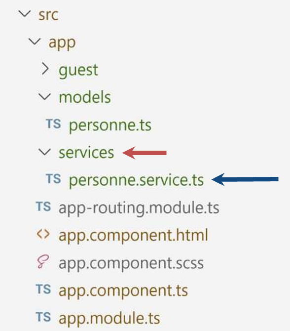

# Module 10 - Mise en place d'un Service
 

 

:one: Pourquoi mettre en place un service ?    
:two: Création d'un service    
:three: Ajouter les méthodes pour modififier le tableau  
:four: Mettre le service dans les "provider"   
:five: Appeler le service depuis le composant principal   
-  Récupérer les données du service    
- Modifier les données du service   

:six: Appeler le service depuis un autre composant      


## :one: Pourquoi mettre en place un service ?

- Partager les données
- Centraliser les données
- Une seule source à jour de vérité  

--------------------------------

 $\color{red}{\text{SANS Le service}}$  


--------------------------------

 $\color{green}{\text{AVEC Le Service}}$
 - Le service contient désormais **le tableau** d'objets


--------------------------------
 
 Pour modifier les données :
- Chaque componsant appelle désormais **les méthodes** du service


--------------------------------

## :two: Création du Service
Création du répertoires <code>services</code> dans le répertoire <code>app</code>
- Création du fichier <code>personne.service.ts</code>


**personne.service.ts**
```ts
import { Personne } from "../../models/Personnes";

export class PersonneService {
    personnes:Personne[]=[
        {prenom:'Brad',nom:'PITT'},
        {prenom:'Nicolas',nom:'CAGE'},
        {prenom:'Angelina',nom:'JOLIE'},
    ];
}
```

## :three: Ajouter les méthodes pour modififier le tableau
- Dans le fichier TypeScript du component principal
 - Le service est récupérer par injection de dépendance
 - C'est-à-dire qu'il est instancier dans le constructeur
- Vérifier que le la classe du service est bien importée

**personne.service.ts**
```ts
import { Personne } from "../../models/Personnes";

export class PersonneService {
    personnes:Personne[]=[
        {prenom:'Brad',nom:'PITT'},
        {prenom:'Nicolas',nom:'CAGE'},
        {prenom:'Angelina',nom:'JOLIE'},
    ];
    // les méthodes
    ajouter(p:Personne):void{
        this.personnes.push(p)
    }
    enlever(i:number):void{
        this.personnes.splice(i,1);
    }
}
```

## :four: Ajouter le service en tant provider
**app.config.ts**
```ts
import { ApplicationConfig } from '@angular/core';
import { PersonneService } from './services/personne.
//...
export const appConfig: ApplicationConfig = {
  providers: [
    PersonneService
  ]
};
```

## :five: Appeler le service depuis le composant principal

**app.component.ts**
```ts
import { Component, OnInit } from '@angular/core';
import { PersonneService } from './services/personne.service';
//..
export class AppComponent implements OnInit{
 personnes:Personne[] =[];
 constructor(private personneService:PersonneService){}
 ngOnInit(): void {
    this.personnes = this.personneService.personnes;
 }

// ajouter la méthode pour ajouter ds le service
 ajouter(f:NgForm){
  const p = new Personne(f.value['prenom'],f.value['nom']);
  f.reset();
  this.personneService.ajouter(p);
 }
}
```

## :six: Appeler le service depuis un autre composant 
**guest.component.ts**
```ts
export class GuestComponent {
constructor(private personneService:PersonneService){}
@Input() personne:Personne=new Personne();
@Input() indice:number=0;
  onEnlever() {
    this.personneService.enlever(this.indice);
  }
}   
```
