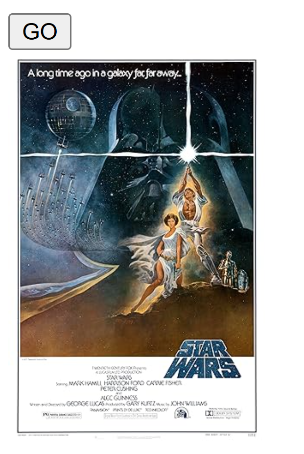
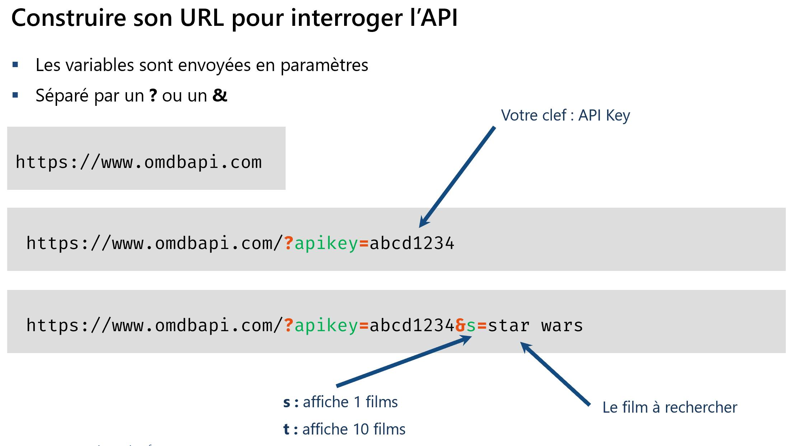

# Module 11 - Interroger une API
- Choisir une API à interroger
- Utiliser l’objet httpClient depuis un composant



## Ajouter le provideHttpClient  en tant provider
**app.config.ts**
```ts
import { ApplicationConfig } from '@angular/core';
import { provideHttpClient } from '@angular/common/http';

export const appConfig: ApplicationConfig = {
  providers: [
    provideHttpClient()
  ]
};
```
## Ajouter le HttpClient dans le composant
**app.component.ts**
```ts
import { HttpClient } from '@angular/common/http';
//...

export class AppComponent {
  img:string='';
  constructor(private httpClient: HttpClient){}
  onAfficher(){
  const key = "efdc2275";
  const url = `http://www.omdbapi.com/?apikey=${key}&t=star` ;
    this.httpClient.get<any>(url).subscribe(
     data => this.img = data['Poster']);
  } 
}
```


**app.component.html**
```html
<button (click)="onAfficher()">GO</button>
<br>

```


# Démo pour afficher un tableau de films
```html
<form (ngSubmit)="onSearch(film)" #film="ngForm" >
  <br>
  <input type="text" name="film" placeholder="Nom du film" ngModel>
<br>
<button type="submit">GO</button>
</form>

<ul *ngFor="let film of films">
  <li>
    <h3>{{film.Title}}</h3>
       
  </li>
</ul>
```

```ts
import { CommonModule } from '@angular/common';
import { HttpClient } from '@angular/common/http';
import { Component } from '@angular/core';
import { NgForm,FormsModule } from '@angular/forms';
import { RouterOutlet } from '@angular/router';

@Component({
  selector: 'app-root',
  imports: [RouterOutlet,CommonModule,FormsModule],
  templateUrl: './app.component.html',
  styleUrl: './app.component.scss'
})
export class AppComponent {
  films:any[]=[];
  // httpClient
  constructor(private httpClient:HttpClient){}
  onSearch(form:NgForm){
    const api ='efdc2275';
    const film = form.value['film'];
    form.reset();
    const url=`http://www.omdbapi.com/?apikey=${api}&s=${film}`
    this.httpClient.get<any>(url).subscribe(
      data => {
        this.films = data.Search;
        console.log(this.films);
      }
    );
  }
  
}

```