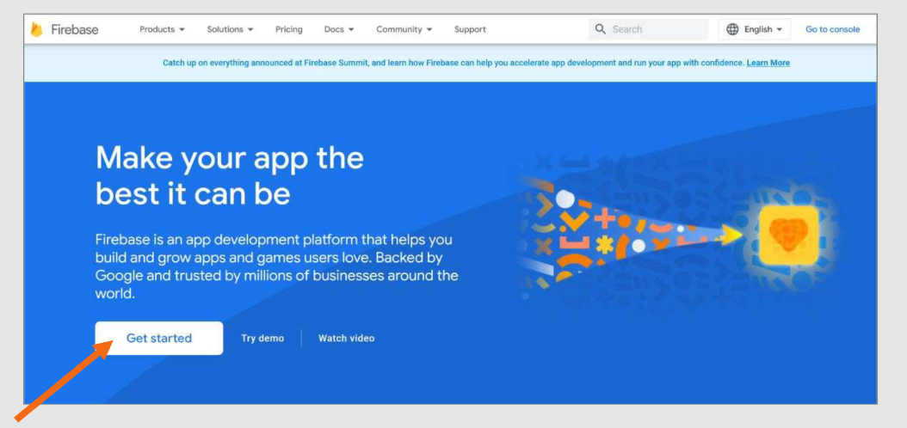
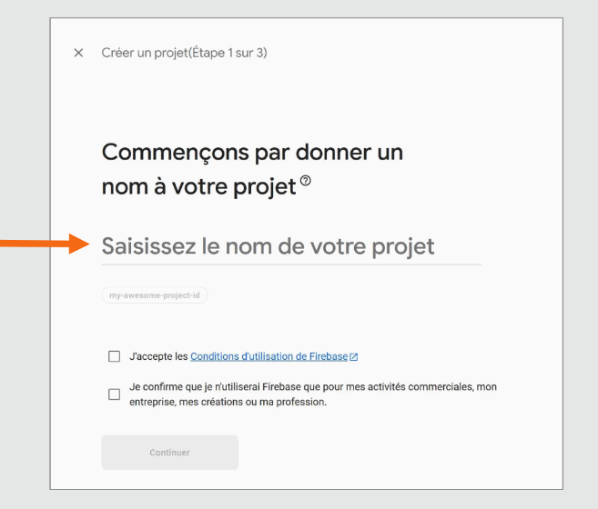
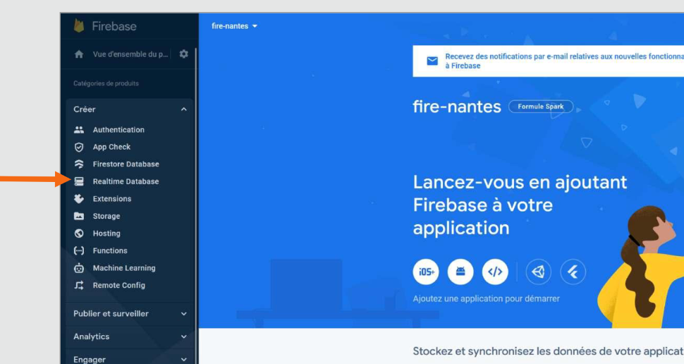
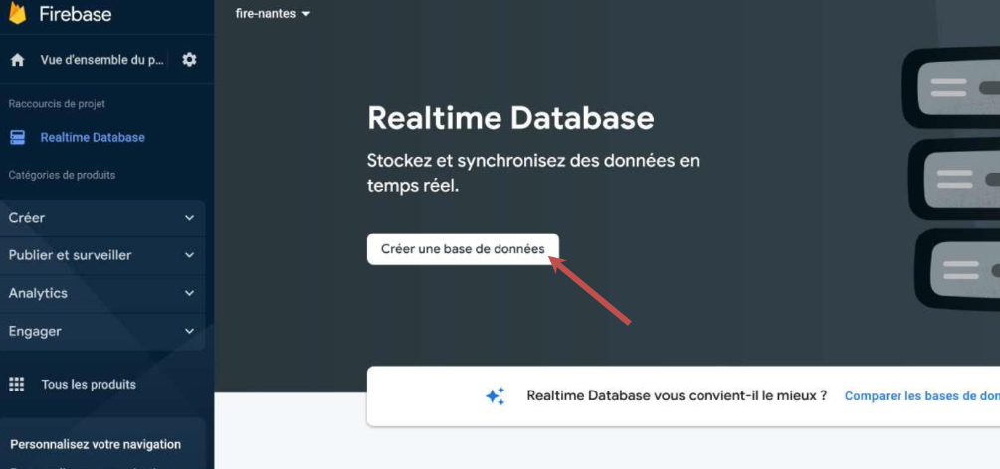
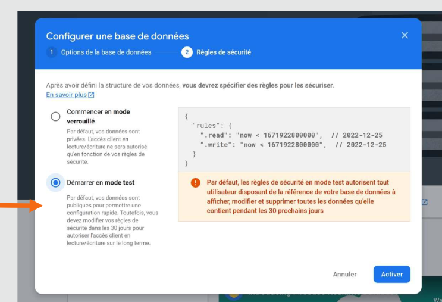
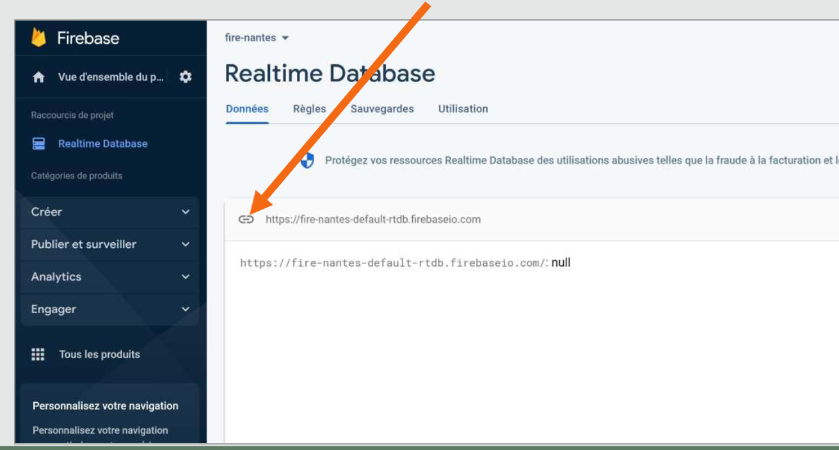

# Module 13 - Communiquer avec une  API

## Créer une API de type backend = NO Backend
Sur FireBase
Nous allons activer le service Real **Time Data Base**
<a href="">firebase</a>
  
    

  
:one: Créer un Projet 
   



:two: Aller sur la section **Real Time data base**  


:three: Créer une **Real Time data base**  

  
:four: Activer **le mode test**  


:five: Cliquez les les chaînes pour copier coller l'url de la data base  



:six: On copie colle le lien de la chaine dans l'attribut <code>url</code>  

```ts
import { HttpClient } from '@angular/common/http';
import { Component } from '@angular/core';

@Component({
  selector: 'app-root',
  imports: [],
  templateUrl: './app.component.html',
  styleUrl: './app.component.scss'
})
export class AppComponent {
  personnnes:any[] =[
    {prenom:'Brad',nom:'PITT'},
    {prenom:'Nicolas',nom:'CAGE'}
    ];
  url='https://alpha-javascript-default-rtdb.europe-west1.firebasedatabase.app/personnes.json';
  constructor(private httpClient:HttpClient){}
  onSave(){
   this.httpClient.put(this.url,this.personnnes).subscribe(
      (response)=> {
         console.log(response)}
    );
  }
  onRead(){
    this.httpClient.get<any[]>(this.url).subscribe(
      (response)=> {
         console.log(response)}
    );
  }
  
}
```

# Démo complète
```html
<button (click)="onAJouter()">Ajouter</button>

<button (click)="onLoad()">Load</button>

<button (click)="onEnlever()">Enlever</button>
<button (click)="onModifier()">Modifier</button>
```

```ts
import { CommonModule } from '@angular/common';
import { HttpClient } from '@angular/common/http';
import { Component } from '@angular/core';
import { NgForm,FormsModule } from '@angular/forms';
import { RouterOutlet } from '@angular/router';

@Component({
  selector: 'app-root',
  imports: [RouterOutlet,CommonModule,FormsModule],
  templateUrl: './app.component.html',
  styleUrl: './app.component.scss'
})
export class AppComponent {
// httpClient
url:string = 'https://paris-vip-default-rtdb.europe-west1.firebasedatabase.app/';
noeud ='personne.json'
constructor(private httpClient:HttpClient){}
  onAJouter():void{
    console.log('ok');
    const url2 = `${this.url}${this.noeud}`;
    const personne = {prenom:'Brad',nom:'PITT'};
    this.httpClient.post<any>(url2,personne).subscribe(
      data =>{
        const id = data.name;
        console.log(id);
      } 
    )
  
 }
 onLoad(){
   const url2 = `${this.url}${this.noeud}`;
   this.httpClient.get<any>(url2).subscribe(
    data => {
      console.log(data);
      const personnes =[]
      for (let attribut in data){
        console.log (attribut); // id1
        console.log( data[attribut]) // {prenom:'Brad',nom:PITT}
        const p = data[attribut];
        p.id = attribut
        personnes.push(p)
      }
      console.log(personnes)
    }
   )
}
onEnlever():void{
  const id ='-OQCiDY1kCeNXBw_vZC1'
 const url2 = `${this.url}personne/${id}/.json`;
 this.httpClient.delete(url2).subscribe(
  data => {
    console.log(data); // null
    }
 )
}
onModifier():void{
  const id ='-OQCi0tAPsnw1u9oNT1n'
 const url2 = `${this.url}personne/${id}/.json`;
 const p:any ={'prenom':'toto',age:18};
 this.httpClient.patch(url2,p).subscribe(
  data => {
    console.log(data); // null
    }
 )
}
}
```