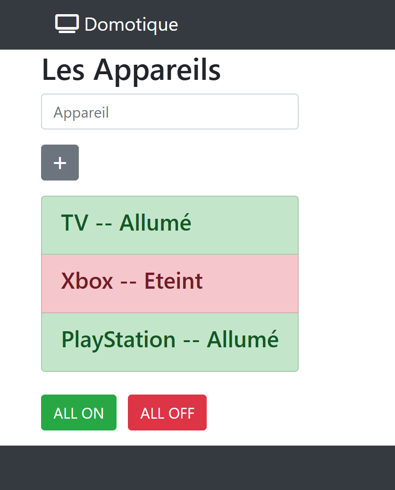

# TP Delta Domotique
**live preview** :  
[Tester le TP Delta](https://www.sevenvalley.fr/tp-javascript/tpd)
  


A partir du fichier <code>tp-domotique-1.html</code>  

- Créer le BO Business Object <code>appareil.ts</code>
- Créer le component   <code>AppareilComponent</code>
- Créer un tableau d'objet appareils  
- Ajouter un appareils    
- Allumer / Eteindre tous les appareils 

```js
const appareils =[
    {name:'TV', status:true},
    {name:'Xbox', status:false},
    {name:'Machine à café', status:true}
];
```
