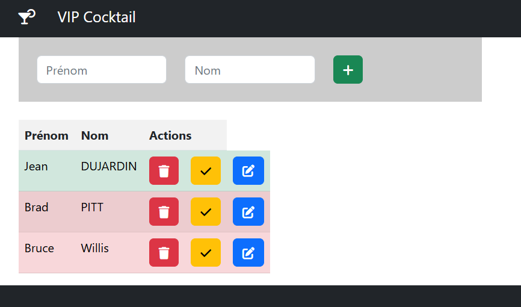

# TP 11 - Créer une route pour modifier une personne

La Home page :

La page Builder

La page Modifier

- Créez une home page sans bouton en fonction de la maquette fourni
- <code> vip-cocktail-1.html</code>
- <code> vip-cocktail-2.html</code>
- <code> vip-cocktail-3.html</code>
- Créez une page pour editer le nom et prenom
  <code> modifier/:id</code>
