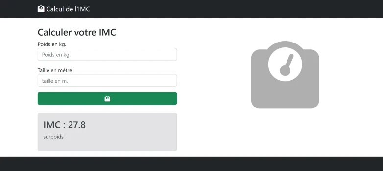

# TP 01 - Calul de l'imc Simple
## :warning: La correction

  



# Partie 1 sans bootstrap
<code>app.components.html</code>

```html
<h1>Calcul de l'IMC</h1>
<input type="text" [(ngModel)]="poids" placeholder="Poids en kg.">
<br>
<input type="text" [(ngModel)]="taille" placeholder="Taille en mètre">
<br>
<button (click)="onCalcul()">Calculer</button>
<h1>{{imc}}</h1>
```
<code>app.components.ts</code>
  
```ts
import { Component } from '@angular/core';
import { FormsModule } from '@angular/forms';


@Component({
  selector: 'app-root',
  imports: [FormsModule],
  templateUrl: './app.component.html',
  styleUrl: './app.component.scss'
})
export class AppComponent {
 // attribut des champs input
 poids:string ='';
 taille:string ='';
 imc:string=''; // tofixed => '24.7'
 onCalcul():void{
  const imc2 = Number(this.poids)/(Number(this.taille)*Number(this.taille));
  this.imc = imc2.toFixed(1);
 }
}

```

# Partie 2 avec la maquette bootstrap

<code>app.components.html</code>

```html
 <nav class="navbar navbar-expand-lg navbar-dark bg-dark">
      <div class="container">
        <a class="navbar-brand" href="#">
          <i class="fa-solid fa-weight-scale"></i>
          Calcul de l'IMC</a
        >
      </div>
    </nav>
    <div class="container">
      <div class="row">
        <div class="col-4 pt-4">
          <h1 class="h3">Calculer votre IMC</h1>
          <label for="poids">Poids en kg.</label>
          <input 
           aria-label="Taille"
          type="text" class="form-control mb-3" [(ngModel)]="poids" placeholder="Poids en kg.">
          <label for="poids">Taille en m</label>
          <input
           aria-label="Taille"
          type="text"   class="form-control mb-3"[(ngModel)]="taille" placeholder="Taille en mètre">
         

          <button 
          (click)="onCalcul()"
          class="btn btn-success my-3 col-12">
            <i class="fa-solid fa-weight-scale"></i>
          </button>

         

          <div *ngIf="imc.length > 0" class="alert my-3 alert-secondary">
            <div>IMC : {{imc}}</div>
            <div>{{ tranche }}</div>
            <div>{{ objectif }}</div>
          </div>
          
        </div>
      </div>
    </div>
    <footer class="py-5 bg-dark">
      <div class="container px-4 px-lg-5">
        <p class="m-0 text-center text-white">
          Copyright &copy; Seven Valley 2024
        </p>
      </div>
    </footer>
```
<code>app.components.ts</code>
```ts
import { CommonModule } from '@angular/common';
import { Component } from '@angular/core';
import { FormsModule } from '@angular/forms';


@Component({
  selector: 'app-root',
  imports: [FormsModule, CommonModule],
  templateUrl: './app.component.html',
  styleUrl: './app.component.scss'
})
export class AppComponent {
  // attribut des champs input
  poids: string = '';
  taille: string = '';
  imc: string = ''; // tofixed => '24.7'
  tranche: string = '';
  objectif:string='';
  onCalcul(): void {
    const imc2 = Number(this.poids) / (Number(this.taille) * Number(this.taille));
  
    this.imc = imc2.toFixed(1);
    if (imc2 > 25){
      // objectif en surpoids
      const poidsIdeal = 25 *parseFloat(this.taille) *parseFloat(this.taille);
      const kilo = poidsIdeal - parseFloat(this.poids);
      this.objectif= 'Objectif :'+poidsIdeal.toFixed(1)+' kg ('+kilo.toFixed(1)+'kg)'; 
    }
    if (imc2 < 18.5) {
      this.tranche = 'maigreur'
      // objectif en maigreur
      const poidsIdeal = 18 *parseFloat(this.taille) *parseFloat(this.taille);
      const kilo = poidsIdeal - parseFloat(this.poids);
      this.objectif= 'Objectif :'+poidsIdeal.toFixed(1)+' kg (+'+kilo.toFixed(1)+'kg)'; 
    }
    else if (imc2 < 25) { // 18.5 < imc < 25
      this.tranche = 'normale'
    }
    else if (imc2 < 30) {
      this.tranche = 'surpoids'
    }
    else if (imc2 < 35) {
      this.tranche = 'obésité'
    }
    else if (imc2 < 40) {
      this.tranche = 'obésité massive'
    } else if (imc2 > 40) {
      this.tranche = 'obésité morbide'
    }
    // je vide les 2 champs input
    this.poids ='';
    this.taille ='';
  }
}

```