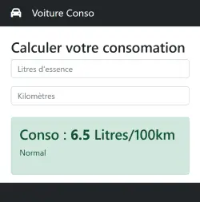

# TP 03 - Conso voiture partie 2
**Sans bouton**
## :warning: La correction


 
<code>app.components.html</code>

```html
<nav class="navbar navbar-expand-lg navbar-dark bg-dark">
  <div class="container">
    <a class="navbar-brand" href="#">
      <i class="fa-solid fa-car me-3"></i>
      Voiture Conso</a>
  </div>
</nav>
<div class="container">
  <div class="row">
    <div class="col-4 pt-4">
      <h1 class="h3">Calculer votre consomation</h1>
   
      <input (keyup)="calcul()" aria-label="litre" [(ngModel)]="litre" class="form-control" placeholder="Litres d'essence" />

      <input (keyup)="calcul()" aria-label="km" [(ngModel)]="km" class="form-control my-3" placeholder="Kilomètres" />
    
   

      <div class="alert mt-4" role="alert" *ngIf="conso.length > 0"
        [class]="getClass()"
        >
        <h3>Conso : <b>{{conso}}</b> Litres/100km</h3>
        <p>Normal</p>
      </div>

    </div>
  </div>
</div>


<footer class="py-5 bg-dark">
  <div class="container px-4 px-lg-5">
    <p class="m-0 text-center text-white">
      Copyright &copy; Seven Valley 2024
    </p>
  </div>
</footer>
```

<code>app.components.ts</code>

```ts
import { CommonModule } from '@angular/common';
import { Component } from '@angular/core';
import { FormsModule, NgForm } from '@angular/forms';

@Component({
  selector: 'app-root',
  standalone: true,
  imports: [CommonModule, FormsModule],
  templateUrl: './app.component.html',
  styleUrl: './app.component.scss'
})
export class AppComponent {
  litre = '';
  km = '';
  conso = '';
  calcul() {
    if (this.litre.length>0 && this.km.length>0) {
      
    
    const consoVal = (parseFloat(this.litre) * 100) / parseFloat(this.km)
    this.conso = consoVal.toFixed(1);
    }
  }
  getClass() {
    if (parseFloat(this.conso) < 7) {
      return 'alert-success';
    }
    else if (parseFloat(this.conso) < 9) {
      return 'alert-warning';
    }
    else {
      return 'alert-danger';
    }
  }
}
```

