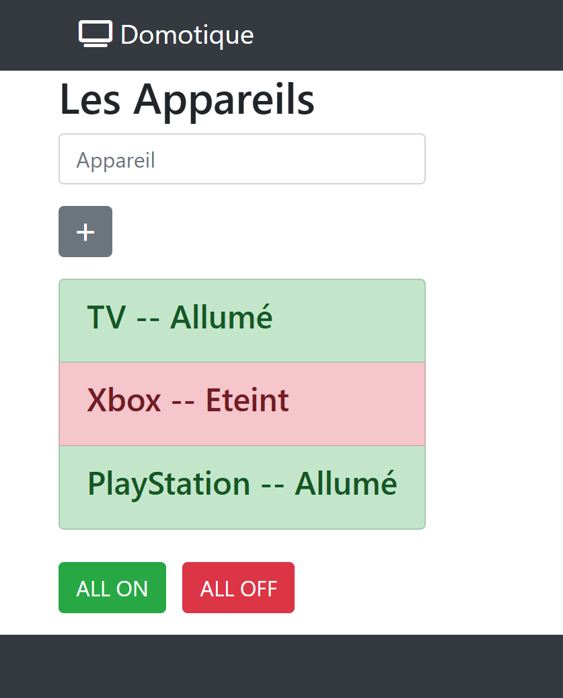

# TP Delta Domotique
## :warning: La correction


**live preview** :  
[Tester le TP Delta](https://www.sevenvalley.fr/tp-javascript/tpd)
  


<code>models/apppareil.ts</code>

```ts
export class Appareil{
    public status:boolean;
    constructor(public nom?:string){
        this.status = false;
    }
}
```

<code>app.component.html</code>

```html
<form (ngSubmit)="onAjouter(a)" #a="ngForm">
  <input type="text" name="nom" ngModel>
  <button class="btn btn-success" type="submit">
    <i class="fa fa-plus"></i>
  </button>
</form>
<ul>
  <app-appareil 
  *ngFor="let appareil of appareils;index as indice"
  [appareil]="appareil"
  [indice]="indice"
  ></app-appareil>

</ul>
<button (click)="onSwitch(true)">ON</button>
<button (click)="onSwitch(false)">OFF</button>
```

<code>app.component.ts</code>

```ts
import { Component } from '@angular/core';
import { FormsModule, NgForm } from '@angular/forms';
import { RouterOutlet } from '@angular/router';
import { Appareil } from './models/appareil';
import { AppareilComponent } from './appareil/appareil.component';
import { CommonModule } from '@angular/common';

@Component({
  selector: 'app-root',
  imports: [RouterOutlet,AppareilComponent,CommonModule,FormsModule],
  templateUrl: './app.component.html',
  styleUrl: './app.component.scss'
})
export class AppComponent {
  appareils:Appareil[]=[];
  onAjouter(formAppareil:NgForm){
    console.log('ajout');
    const appareil = new Appareil(formAppareil.value['nom']);
    // vider le champ input
    this.appareils.push(appareil);
    formAppareil.reset();
    console.log(this.appareils);
  }
  onSwitch(status:boolean):void{
    // for ( let appareil of this.appareils){
    //   appareil.status = status
    // }
    this.appareils.map(appareil => appareil.status=status);
  }
}
```

<code>appareil.component.html</code>

```html
<p>
    {{indice}}
    {{appareil.nom}}
    {{appareil.status}}

</p>
```

<code>appareil.component.ts</code>

```ts
import { Component, Input } from '@angular/core';
import { Appareil } from '../models/appareil';

@Component({
  selector: 'app-appareil',
  imports: [],
  templateUrl: './appareil.component.html',
  styleUrl: './appareil.component.scss'
})
export class AppareilComponent {
@Input() appareil:Appareil = new Appareil();
@Input() indice:number=0;

}

```

# Intégration graphique avec la maquette


<code>app.component.html</code>

```html
<p>
<div class="container">
		<div class="row">
			<div class="col-4">

				<h2>Les Appareils</h2>

<form (ngSubmit)="onAjouter(a)" #a="ngForm">
  <input type="text" class="form-control my-3" name="nom" ngModel>
  <button class="btn btn-success m-3" type="submit">
    <i class="fa fa-plus"></i>
  </button>
</form>
<ul class="list-group">
  <app-appareil 
  *ngFor="let appareil of appareils;index as indice"
  [appareil]="appareil"
  [indice]="indice"
  ></app-appareil>

</ul>

			<br>
			<button (click)="onSwitch(true)" class="btn btn-success me-3">ALL ON</button>

			<button  (click)="onSwitch(false)" class="ml-2 btn btn-danger">ALL OFF</button>
		</div>
	</div>
</div>
```

<code>app.component.ts</code>

```ts
import { Component } from '@angular/core';
import { FormsModule, NgForm } from '@angular/forms';
import { RouterOutlet } from '@angular/router';
import { Appareil } from './models/appareil';
import { AppareilComponent } from './appareil/appareil.component';
import { CommonModule } from '@angular/common';

@Component({
  selector: 'app-root',
  imports: [RouterOutlet,AppareilComponent,CommonModule,FormsModule],
  templateUrl: './app.component.html',
  styleUrl: './app.component.scss'
})
export class AppComponent {
  appareils:Appareil[]=[];
  onAjouter(formAppareil:NgForm){
    console.log('ajout');
    const appareil = new Appareil(formAppareil.value['nom']);
    // vider le champ input
    this.appareils.push(appareil);
    formAppareil.reset();
    console.log(this.appareils);
  }
  onSwitch(status:boolean):void{
    // for ( let appareil of this.appareils){
    //   appareil.status = status
    // }
    this.appareils.map(appareil => appareil.status=status);
  }
}

```


<code>appareil.component.html</code>

```html
<li class="list-group-item"
[ngClass]="{
    'list-group-item-success': appareil.status == true,
    'list-group-item-danger': appareil.status== false
}"
>
    <h4> {{appareil.nom}}</h4>

</li>
```

<code>appareil.component.ts</code>

```ts
import { Component, Input } from '@angular/core';
import { Appareil } from '../models/appareil';
import { CommonModule } from '@angular/common';

@Component({
  selector: 'app-appareil',
  imports: [CommonModule],
  templateUrl: './appareil.component.html',
  styleUrl: './appareil.component.scss'
})
export class AppareilComponent {
@Input() appareil:Appareil = new Appareil();
@Input() indice:number=0;

}
```