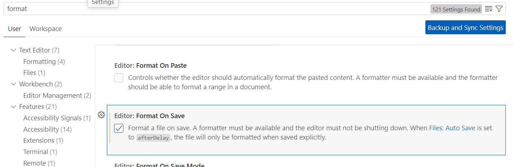

# liens des plugins VS CODE

## Angular Language Service

https://marketplace.visualstudio.com/items?itemName=Angular.ng-template

## Prettier

https://marketplace.visualstudio.com/items?itemName=esbenp.prettier-vscode

Setting > text Editor > Format on save  


# Les raccourcis VS CODE

## Dupliquer une ligne

<kbd>Alt</kbd> + <kbd>Shift</kbd> + <kbd>fleche</kbd> (fleche haut et bas)

## Déplacer la ligne ou un bloque

<kbd>Alt</kbd> + <kbd>fleche</kbd>

## Modifier plusieurs occurance

Je met surbrillance puis x le nombre d'occurance  
<kbd>Ctrl</kbd> + <kbd>D</kbd>

## Supprimer la ligne

<kbd>Ctrl</kbd> + <kbd>Shift</kbd> + <kbd>k</kbd>

## Ré indenter le code

<kbd>Shift</kbd> + <kbd>Alt</kbd> + <kbd>f</kbd>

## Rechercher dans tous les fichiers

<kbd>Ctrl</kbd> + <kbd>Shift</kbd> + <kbd>f</kbd>

## mettre en commentaire plusieurs lignes

<kbd>Ctrl</kbd> + <kbd>/</kbd>

# Emmet

## Activer emmet

file > preferences > settings  
je tape "emmet"  
j'active trigger on tab

# structure HTML

<kbd>!</kbd> + <kbd>tab</kbd>

.container

```html
<div class="container"></div>
```

.toto

```html
<div class="toto"></div>
```

#titre

```html
<div id="titre"></div>
```

les tableaux :

```
table>thead>tr>th*6
```

```
tbody>tr*2>td*3
```

```
table>thead>tr>th*3^^tbody>tr*2>td*3
```

Les tableaux

```html
<table>
  <thead>
    <tr>
      <th>#</th>
      <th>Prénom</th>
      <th>Nom</th>
    </tr>
  </thead>
  <tbody>
    <tr>
      <td>0</td>
      <td>Brad</td>
      <td>PITT</td>
    </tr>
    <tr>
      <td>1</td>
      <td>Tom</td>
      <td>Cruise</td>
    </tr>
  </tbody>
</table>
```

# Liens sympa

Admin panel  
https://themeforest.net/category/site-templates/admin-templates

Admin panel avec Angular  
https://themeforest.net/category/site-templates/admin-templates?term=angular

Formation Open classrooms Angular  
https://openclassrooms.com/fr/courses/7471281-perfectionnez-vous-sur-angular

Chaine Youtube formation Angular  
https://www.youtube.com/@evanboissonnot3668

Cours Udemy Angular 19  
https://www.udemy.com/course/the-complete-guide-to-angular-2/

Maquettes bootstrap  
https://startbootstrap.com/templates/landing-pages  
https://startbootstrap.com/template/small-business

changer le themes de bootstrap  
https://bootswatch.com/

le openclassrooms de Envato  
https://tutsplus.com/
